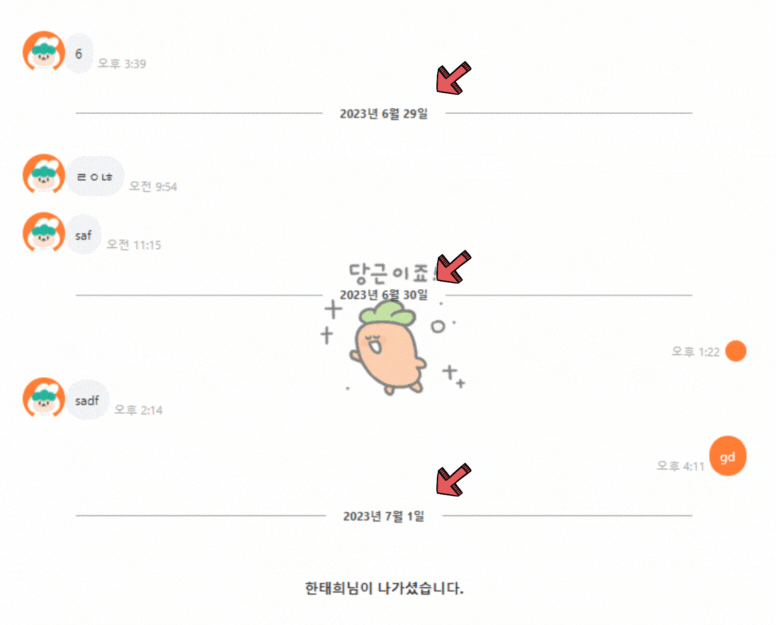
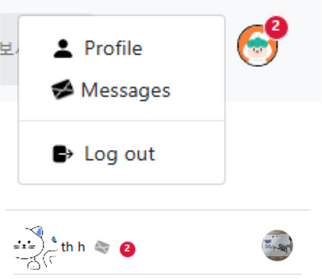
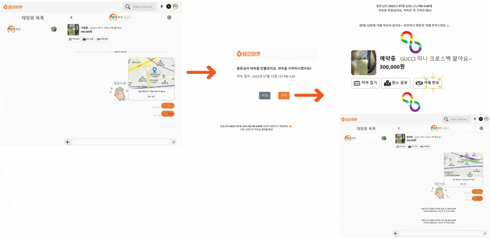
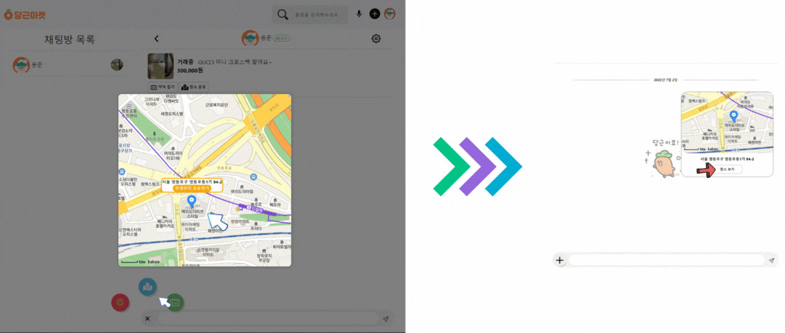

# 비트마켓
## Info
비트마켓은 환경보호와 지속 가능한 소비 문화를 더욱 확산시키기 위한 중고 거래 플랫폼입니다.
 
이를 통해 소비자들은 경제적 이점을 누리고, 관계자 간에는 직접적인 소통이 가능해집니다. 장기적인 관점에서 지구를 지키며, 경제적 이익을 창출할 수 있는 중고 거래 플랫폼 비트마켓에 많은 관심과 참여를 기대합니다.

## 제작기간📆
2023.05.12 ~ 2023.07.02

## workmate
* [권용준](https://github.com/kwonyongjun9978) [실시간 채팅 기능 및 채팅 페이지 구현]
  ### 중고 거래 플랫폼의 특성상 중요한 특징을 생각해보았을때 처음 들었던 생각이 바로 판매자와 구매자간의 원활한 의사소통이였습니다🤔 판매자와 구매자간의 원활한 의사소통이 되어야 물건을 보다 손쉽게 사거나 팔수 있겠죠..?👌 그래서 저는 해당 프로젝트를 진행하면서 구매자와 판매자간의 원활한 의사소통을 할수 있게끔 해주는 실시간 채팅 기능 개발을 진행해 보았습니다☺️
  - 타임스탬프
    
    

    그날 하루, 처음 채팅창에 입장을 하게되면 현재 날짜가 뜰수 있게 moment-timezone이라는 라이브러리를 사용하여 타임스탬프 기능을 추가했습니다.

  - Push 알림

    

    내가 채팅을 보내면 상대방은 페이지 상단의 프로필 이미지쪽과 채팅방 목록쪽에 내가 채팅을 보낸 횟수만큼 실시간으로 알림이 뜨게 구현을 했습니다.
    
  - 이모티콘 발송

    

    이모티콘 같은 경우는 emoji-picker-react 라이브러리를 사용했습니다.

    이모티콘 버튼을 누르게 될시 채팅입력창 밑에 이모티콘 선택창이 생기면서 원하는 이모티콘을 선택해서 전송할수 있게 구현했습니다.
    
  - 약속 잡기

    
    
    약속잡기 기능은 mui date-pickers 라이브러리를 사용하였습니다.
    
    달력이미지 버튼을 클릭하면 모달창 방식으로 약속잡기 창이 뜨게 되고, 해당 창에서 약속 날짜와 시간을 선택하고 ok 버튼을 누르면 상대방 채팅 페이지에서는 내가 지정한 약속날짜가 뜨면서 약속 수락, 거절 버튼 이 뜨게 되는데, 만약 상대방이 약속을 거절하면 약속을 거절했고 다시 약속을 잡아달라는 메세지가 채팅창에 뜨게 됩니다.
    
    그리고 상대방이 약속을 수락했다면 채팅창의 header 부분밑에 있는 text가 거래중에서 예약중으로 변경되고 장소공유하기 버튼 옆에 거래완료 버튼이 생기게 됩니다.
    
    실질적으로 상대방과의 거래가 완료되고 거래완료버튼을 누르게 될시 confetti 라이브러리를 사용하여 축하 이팩트를 구현하였습니다.
    
    이후 거래 완료버튼 옆에 후기 보내기 버튼이 생기면서 후기 보내기 버튼을 누르게 될시 프로필 페이지로 이동하여 구매 후기를 남길수 있습니다.
    
  - 위치 공유

    
    
    위치공유 기능은 kakao-map-api를 사용해서 구현했습니다.
    
    위치공유 기능을 개발하는 과정에서 kakao-map-api 공식문서에 나와있는 html코드를 react 함수형 컴포넌트 코드로 변경하면서 잦은 오류가 발생하였습니다.
이렇게, 여러 시행착오를 겪다가 결국 react-kakao-maps-sdk 라이브러리를 찾게 되었고, 보다 손쉽게 react환경에서 kakao-map-api 사용하게 되었습니다.

    하늘색 지도이미지 버튼을 클릭하면 모달창 방식으로 지도가 뜨면서 사용자의 현재 위치를 가져오는 geolocation API를 사용하여 사용자의 현재위치가 나오게 됩니다.
    
    해당 지도에서 클릭 이벤트가 발생하면 마커가 표시되면서 해당 마커를 클릭함과 동시에 위도,경도값을 주소값으로 변경해서 해당 주소가 나오게 됩니다.
    
    해당주소 밑에있는 현재위치 공유하기 버튼을 클릭하면 마커로 찍은 위치가 메세지로 전송이 됩니다.
    
    그리고 장소 보기 버튼을 누르면 카카오 맵 사이트로 이동할수 있게끔 구현했습니다.
  - 무한스크롤
    
  - 채팅방 나가기
    
  - 신고하기
    
  - URL 링크 공유 기능
  
* [강성욱](https://github.com/ksqrt)
  - Github 병합 및 감독  
  - 도커 이미지 관리 
  - 쿠버네티스 배포  
  - 이미지서버(S3) 관리 및 설정  
  - STT 서비스 (음성 → 텍스트 AI)  
  - 물건 검색 기능 
  - 카테고리 정렬 기능 
  - 카테고리 무한스크롤 페이징 기능
  - Header, Footer 개발
  - 발표 PPT 작성
  - 회의록 작성
 
* [이정규](https://github.com/dlqhdwo1)
  - 카카오 API 개발 
  - 신고제품관리
  - 신고유저관리
  - 홈페이지 대시보드 관리
  - 프로필 수정 
  - 회원탈퇴
  - 어드민 페이지 무한스크롤

  
 - 신고된 유저는 어드민 계정내의 report필드에 신고유저ID와 유저네임, 신고내용이 저장되게됩니다.
 - 어드민 유저로 로그인시 어드민 페이지 화면으로 이동을 할 수 있게됩니다.
 - 유저관리 : 사용자들로부터 신고된 유저들의 목록을 볼수있고, 신고된 사유를 볼 수 있습니다.
 - 회원탈퇴 : 신고된 사유가 적합하다면 어드민은 회원계정을 삭제 할 수 있습니다.
     

 

  - 신고된 제품은 db내의 declare 필드값이 true로 변경되게 됩니다.
  - 제품관리 :  declare필드값이 true인 값들을 출력하게됩니다. (신고된 제품 출력)
  - 제품 삭제하기 : 어드민은 신고된 제품을 클릭하여 상세 제품정보를 확인후 적합하지 않은 제품일시 제품을 삭제할 수 있습니다.

 
 
  - Nivo Pie라이브러리 : Nivo-pie라이브러리를 이용해 카테고리별로 제품수를 좀더 시각화 하기위해 원형모형으로 표현하였습니다.
  
  - Nivo Bar라이브러리 : Nivo-bar라이브러리를 이용해 카테고리별로 거래현황을 거래중은 주황색막대기 거래완료는 파란색 막대기로 표현하였습니다. 

* [엄태훈](https://github.com/PRESSANYKEYBOARD)
  - 버그 픽스 담당
  - 판매 물품 상세페이지
  - MongoDB 환경 구축
  - Github 병합 및 감독
  - 물건 상세사항 작성
  - README.md 작성
  - Docker 설치 가이드 작성
  - NCP 서버 가이드 작성

* [송성근](https://github.com/gkdltjdrms)
  - 상품 별 메뉴에 상품 표시
  - 거래 후기 게시판   
  - 당근 온도 별 디자인
  - 매너 칭찬하기 
  - 회원 정보
  - 판매중인 상품 무한스크롤
  - 상품등록

* [김소라](https://github.com/ConchK)
  - 회원가입
  - 로그인 / 로그아웃
  - 카카오 · 구글 로그인 API
  - Auth 관리
  - Email 인증 개발
  - 유효성 검사

* [한태희](https://github.com/zknight666)
  - 타임스탬프
  - Push 알림
  - 이모티콘 발송
  - 약속 잡기
  - 위치 공유
  - 거래 완료
  - 무한스크롤
  - 채팅방 나가기
  - 신고하기
  - URL 링크 공유 기능

* [변성훈](https://github.com/sunghunaaa)
  - 카카오 Dev 계정 Owner
  - 카카오 API 개발
  - 조회수 기능 개발
  - 상품 판매 관리 
  - .env 환경 설정
  - VPN 개발 환경 구축
  - MongoDB 컬렉션 초기 설계
  - Base64, 클라우드 이미지 업로드
  - Clova Voice
  - 발표 시연 영상 제작
    
## Skill🛠

### :black_medium_small_square: Tools

| Tool                                                         | 기술                                                  |
| ------------------------------------------------------------ | ----------------------------------------------------- |
| [GitHub](https://github.com/)                                | 각자 맡은 업무를 진행하고 commit · push · merge 작업하기 위한 원격 저장소 |
| [Jira](https://www.atlassian.com/ko/software/jira)           | Issue 관리를 위해 Git과 연동하여 사용                 |
| [Docker](https://www.docker.com/)                            | 테스트 및 배포를 위한 컨테이너 기반 가상화 플랫폼 |
| [VS Code](https://code.visualstudio.com/)                    | Frontend · Backend 구현 Tool                          |
| [MongoDB Compass](https://www.mongodb.com/products/compass) | DataBase Tool                                         |
| [Google Chrome](https://www.google.com/intl/ko_kr/chrome/)  | 구현한 화면을 출력하기 위한 브라우저                  |

### :black_medium_small_square: Library

| Library                                               | 기술                                      |
| ----------------------------------------------------- | ----------------------------------------- |
| [Node.js](https://spring.io/projects/spring-framework) | Frontend 화면 · Backend 서버 구현을 위한 JavaScript Framework   |
| [Express.js](https://expressjs.com/ko/)                | Node.js를 더 안정적으로 사용 가능한 웹 프레임워크 |
| [React](https://ko.legacy.reactjs.org/)                | Fronted 화면 구현
| [React-BootStrap](https://react-bootstrap.netlify.app/) | Frontend 화면 구현을 위한 Library         |
| [MongoDB](https://www.mongodb.com/)                     | DataBase 구현                             |

### :black_medium_small_square: OpenAPI

| OpenAPI                                               | 기술                                      |
| ----------------------------------------------------- | ----------------------------------------- |
| [Kakao API](https://developers.kakao.com/) | 로그인 · 지도 API 사용  |
| [Google API](https://cloud.google.com/apis?hl=ko) | 로그인 API 사용  |

### :black_medium_small_square: Software Language

| Language   | 기술                                     |
| ---------- | ---------------------------------------- |
| JavaScript | Frontend 화면·Backend 서버 구현 언어       |
|            | Frontend: React / Backend: Node.js + Express.js       |
| CSS        | Frontend 디자인 구현                      |
| BSON(NoSQL) | DataBase 구현                            |

### :black_medium_small_square: ETC Tools

| Tool                              | 기술                                 |
| --------------------------------- | ------------------------------------ |
| [한컴오피스](https://www.hancom.com/product/productMain.do?gnb0=23&gnb1=) | 매뉴얼 작성 워드프로세서 프로그램 |
| [Adobe Reader](https://www.adobe.com/kr/acrobat/pdf-reader.html) | 매뉴얼 pdf 뷰어 프로그램 |
| [반디캠](https://www.bandicam.co.kr/) | 동영상 화면 캡처 제작을 위한 녹화 프로그램 |
| [Discord](https://discord.com/) | 실시간 채팅·음성·화면 공유 프로그램 |
    
## 회의록링크
* [5월 16일](https://difficult-wing-0b1.notion.site/2023-05-16-eb0a51bc8326424e9d169b1948120140) 
* [5월 24일](https://difficult-wing-0b1.notion.site/2023-05-24-7dd0bb8416cd49d6ac6cbeb65aaeb64b) 
* [5월 26일](https://difficult-wing-0b1.notion.site/2023-05-26-d8488e96ca7e4e59b0db9a97cc9fa9bb) 
* [6월 7일](https://difficult-wing-0b1.notion.site/2023-06-07-59f4a2cede2246b9b5950d9c60b7fe44?pvs=4) 
* [6월 20일](https://difficult-wing-0b1.notion.site/2023-06-20-e4bc8cf84d514f98869a5949ee442853?pvs=4) 

## PPT
* [PPT](https://www.canva.com/design/DAFlqRNOHns/Vfh2agL7aMnATAE47xbCOA/edit?utm_content=DAFlqRNOHns&utm_campaign=designshare&utm_medium=link2&utm_source=sharebutton)

## Setting Guide
* [MongoDB Setting](https://drive.google.com/file/d/1iBN40hOUbFdv5njA2lWqlsLYoXYBJ4Od/view?usp=sharing)
* [Docker Setting](https://drive.google.com/file/d/1zWK79267pngBbFLRd9a2W_c8-N57ZrBP/view?usp=sharing)
